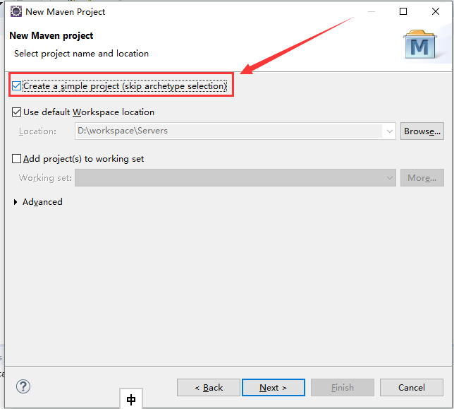
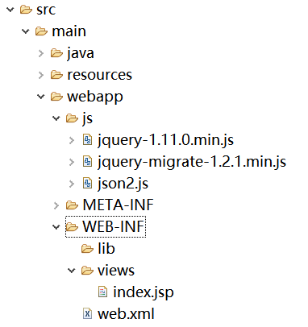

# eclipse下SpringMVC+Maven+Mybatis+MySQL项目搭建
主要是用来当做一个模板，然后开发一个挡板程序用于公司的接口测试

同时这个demo也可以用来快速开发其他web应用。

## 1.创建maven工程
右击-->New->Other

点击->Manven Porject

点击->勾选快速框架

输入项目名，包（Packaging，如果只是普通的项目，选jar就好了，如果是web项目就选war，这里是web项目，所以选择war）

右击项目->Properties->Java Build Path->选择Libraries->点击选中 JRE System Library->Edit

选择默认JRE，注：必须系统安装了JDK。

点击Project Facets 去掉勾选 Dynamic Web Module 再把 Java 改为系统设置版本。

再打开Project Facets ->勾选 Dynamic Web Module 选择3.0版本时，下面有个 Further configuration available... ->点击

输入 content directory 地址： src/main/webapp, **勾选generate web.xml**


## 2.配置springmvc
### 添加包的依赖，编辑pom.xml文件添加如下依赖：（因为我的JDK版本是1.8所以Spring 版本必须为4.0以上）

**pom.xml**
```xml
<project xmlns="http://maven.apache.org/POM/4.0.0" xmlns:xsi="http://www.w3.org/2001/XMLSchema-instance" xsi:schemaLocation="http://maven.apache.org/POM/4.0.0 http://maven.apache.org/xsd/maven-4.0.0.xsd">
  <modelVersion>4.0.0</modelVersion>
  <groupId>com.ynrcc</groupId>
  <artifactId>simple_server</artifactId>
  <version>0.0.1-SNAPSHOT</version>
  <packaging>war</packaging>

  <properties>
        <!-- spring版本号 -->
        <spring.version>4.2.0.RELEASE</spring.version>
        <!-- log4j日志文件管理包版本 -->
        <slf4j.version>1.6.6</slf4j.version>
        <log4j.version>1.2.12</log4j.version>
        <!-- junit版本号 -->
        <junit.version>4.10</junit.version>
        <!-- mybatis版本号 -->
        <mybatis.version>3.2.1</mybatis.version>
    </properties>

    <dependencies>
        <!-- 添加Spring依赖 -->
        <dependency>
            <groupId>org.springframework</groupId>
            <artifactId>spring-core</artifactId>
            <version>${spring.version}</version>
        </dependency>
        <dependency>
            <groupId>org.springframework</groupId>
            <artifactId>spring-webmvc</artifactId>
            <version>${spring.version}</version>
        </dependency>
        <dependency>
            <groupId>org.springframework</groupId>
            <artifactId>spring-context</artifactId>
            <version>${spring.version}</version>
        </dependency>
        <dependency>
            <groupId>org.springframework</groupId>
            <artifactId>spring-context-support</artifactId>
            <version>${spring.version}</version>
        </dependency>
        <dependency>
            <groupId>org.springframework</groupId>
            <artifactId>spring-aop</artifactId>
            <version>${spring.version}</version>
        </dependency>
        <dependency>
            <groupId>org.springframework</groupId>
            <artifactId>spring-aspects</artifactId>
            <version>${spring.version}</version>
        </dependency>
        <dependency>
            <groupId>org.springframework</groupId>
            <artifactId>spring-tx</artifactId>
            <version>${spring.version}</version>
        </dependency>
        <dependency>
            <groupId>org.springframework</groupId>
            <artifactId>spring-jdbc</artifactId>
            <version>${spring.version}</version>
        </dependency>
        <dependency>
            <groupId>org.springframework</groupId>
            <artifactId>spring-web</artifactId>
            <version>${spring.version}</version>
        </dependency>

        <!--单元测试依赖 -->
        <dependency>
            <groupId>junit</groupId>
            <artifactId>junit</artifactId>
            <version>${junit.version}</version>
            <scope>test</scope>
        </dependency>

        <!-- 日志文件管理包 -->
        <!-- log start -->
        <dependency>
            <groupId>log4j</groupId>
            <artifactId>log4j</artifactId>
            <version>${log4j.version}</version>
        </dependency>
        <dependency>
            <groupId>org.slf4j</groupId>
            <artifactId>slf4j-api</artifactId>
            <version>${slf4j.version}</version>
        </dependency>
        <dependency>
            <groupId>org.slf4j</groupId>
            <artifactId>slf4j-log4j12</artifactId>
            <version>${slf4j.version}</version>
        </dependency>
        <!-- log end -->

        <!--spring单元测试依赖 -->
        <dependency>
            <groupId>org.springframework</groupId>
            <artifactId>spring-test</artifactId>
            <version>${spring.version}</version>
            <scope>test</scope>
        </dependency>

        <!--mybatis依赖 -->
        <dependency>
            <groupId>org.mybatis</groupId>
            <artifactId>mybatis</artifactId>
            <version>${mybatis.version}</version>
        </dependency>

        <!-- mybatis/spring包 -->
        <dependency>
            <groupId>org.mybatis</groupId>
            <artifactId>mybatis-spring</artifactId>
            <version>1.2.0</version>
        </dependency>

        <!-- mysql驱动包 -->
        <dependency>
            <groupId>mysql</groupId>
            <artifactId>mysql-connector-java</artifactId>
            <version>5.1.29</version>
        </dependency>

        <!-- fastjson -->
        <dependency>
    		<groupId>com.alibaba</groupId>
    		<artifactId>fastjson</artifactId>
    		<version>1.2.7</version>
		</dependency>

    </dependencies>

</project>
```

**web.xml** (按上面 **勾选generate web.xml** 操作之后，web.xml一般都生成在src/main/webapp/WEB-INF/下)
```xml
<?xml version="1.0" encoding="UTF-8"?>
<web-app xmlns:xsi="http://www.w3.org/2001/XMLSchema-instance"
	xmlns="http://xmlns.jcp.org/xml/ns/javaee"
	xsi:schemaLocation="http://xmlns.jcp.org/xml/ns/javaee
	http://xmlns.jcp.org/xml/ns/javaee/web-app_3_1.xsd"
	id="WebApp_ID" version="3.1">

	<!-- 注意这里的路径要写对 -->
	<welcome-file-list>
		<welcome-file>/WEB-INF/views/index.jsp</welcome-file>
	</welcome-file-list>

	<!-- 配置spring核心监听器 -->
	<listener>
		<listener-class>org.springframework.web.context.ContextLoaderListener</listener-class>
	</listener>
	<!-- contextConfigLocation参数用来指定Spring的配置文件 -->
	<context-param>
		<param-name>contextConfigLocation</param-name>
		<param-value>classpath:/application*.xml</param-value>
	</context-param>

	<!-- 定义Spring MVC的前端控制器 -->
  <servlet>
    <servlet-name>springmvc</servlet-name>
    <servlet-class>
        org.springframework.web.servlet.DispatcherServlet
    </servlet-class>
    <init-param>
      <param-name>contextConfigLocation</param-name>
      <param-value>classpath:/springmvc/spring-mvc.xml</param-value>
    </init-param>
    <load-on-startup>1</load-on-startup>
  </servlet>

  <!-- 让Spring MVC的前端控制器拦截所有请求 -->
  <servlet-mapping>
    <servlet-name>springmvc</servlet-name>
    <url-pattern>/</url-pattern>
  </servlet-mapping>

  <!-- 编码过滤器 -->
  <filter>
		<filter-name>characterEncodingFilter</filter-name>
		<filter-class>org.springframework.web.filter.CharacterEncodingFilter</filter-class>
		<init-param>
			<param-name>encoding</param-name>
			<param-value>UTF-8</param-value>
		</init-param>
 </filter>
	<filter-mapping>
		<filter-name>characterEncodingFilter</filter-name>
		<url-pattern>/*</url-pattern>
	</filter-mapping>
</web-app>
```

### 加入配置文件


**jdbc.properties**(注意自己修改相应配置)
```
jdbc_driverClassName=com.mysql.jdbc.Driver
jdbc_url=jdbc:mysql://localhost:3306/test
jdbc_username=yourUserName
jdbc_password=123456
```
**application.xml(注意自己修改相应配置,如包名)**
```xml
<?xml version="1.0" encoding="UTF-8"?>
<beans xmlns="http://www.springframework.org/schema/beans" xmlns:xsi="http://www.w3.org/2001/XMLSchema-instance" xmlns:context="http://www.springframework.org/schema/context" xmlns:aop="http://www.springframework.org/schema/aop" xsi:schemaLocation=" http://www.springframework.org/schema/beans http://www.springframework.org/schema/beans/spring-beans-3.0.xsd http://www.springframework.org/schema/aop http://www.springframework.org/schema/aop/spring-aop-3.0.xsd http://www.springframework.org/schema/context http://www.springframework.org/schema/context/spring-context-3.0.xsd">

     <!-- 引入jdbc配置文件 -->  
     <bean id="propertyConfigurer" class="org.springframework.beans.factory.config.PropertyPlaceholderConfigurer">
        <property name="locations">
            <list>
               <value>classpath:properties/*.properties</value>
                <!--要是有多个配置文件，只需在这里继续添加即可 -->
            </list>
        </property>
    </bean>


    <!-- 配置数据源 -->
    <bean id="dataSource" class="org.springframework.jdbc.datasource.DriverManagerDataSource">
        <!-- 不使用properties来配置 -->
        <!-- <property name="driverClassName" value="com.mysql.jdbc.Driver" /> <property name="url" value="jdbc:mysql://localhost:3306/learning" /> <property name="username" value="root" /> <property name="password" value="christmas258@" /> -->
       <!-- 使用properties来配置 -->
        <property name="driverClassName">
            <value>${jdbc_driverClassName}</value>
        </property>
        <property name="url">
            <value>${jdbc_url}</value>
        </property>
        <property name="username">
            <value>${jdbc_username}</value>
        </property>
        <property name="password">
            <value>${jdbc_password}</value>
        </property>
    </bean>

    <!-- 自动扫描了所有的XxxxMapper.xml对应的mapper接口文件，这样就不用一个一个手动配置Mpper的映射了，只要Mapper接口类和Mapper映射文件对应起来就可以了。 -->
    <bean class="org.mybatis.spring.mapper.MapperScannerConfigurer">
        <property name="basePackage" value="com.ynrcc.simpleserver.dao" />
    </bean>

    <!-- 配置Mybatis的文件 ，mapperLocations配置**Mapper.xml文件位置，configLocation配置mybatis-config文件位置-->
    <bean id="sqlSessionFactory" class="org.mybatis.spring.SqlSessionFactoryBean">
        <property name="dataSource" ref="dataSource" />
        <property name="mapperLocations" value="classpath:mapper/*.xml"/>  
        <property name="configLocation" value="classpath:mybatis/mybatis-config.xml" />
        <!-- <property name="typeAliasesPackage" value="com.tiantian.ckeditor.model" /> -->
    </bean>

    <!-- spring可以自动去扫描base-pack下面的包或者子包下面的java文件，
    	如果扫描到有Spring的相关注解的类，则把这些类注册为Spring的bean -->
    <context:component-scan base-package="com.ynrcc.simpleserver.service" />

</beans>
```

**mybatis-config.xml**
```xml
<?xml version="1.0" encoding="UTF-8"?>  
<!DOCTYPE configuration PUBLIC "-//mybatis.org//DTD Config 3.0//EN" "http://mybatis.org/dtd/mybatis-3-config.dtd">  
<configuration>    
</configuration>
```

**spring-mvc.xml**
```xml
<?xml version="1.0" encoding="UTF-8"?>
<beans xmlns="http://www.springframework.org/schema/beans" xmlns:p="http://www.springframework.org/schema/p"
xmlns:xsi="http://www.w3.org/2001/XMLSchema-instance" xmlns:context="http://www.springframework.org/schema/context"
xmlns:mvc="http://www.springframework.org/schema/mvc"
xsi:schemaLocation=" http://www.springframework.org/schema/beans http://www.springframework.org/schema/beans/spring-beans-3.2.xsd http://www.springframework.org/schema/context http://www.springframework.org/schema/context/spring-context-3.2.xsd http://www.springframework.org/schema/mvc http://www.springframework.org/schema/mvc/spring-mvc-3.2.xsd">

   <!-- 扫描controller（controller层注入） -->
   <context:component-scan base-package="com.ynrcc.simpleserver.web"/>  

	<!-- 使用默认的Servlet来响应静态文件 -->
    <mvc:default-servlet-handler/>

   <!-- 对模型视图添加前后缀 -->
   <bean id="viewResolver"
          class="org.springframework.web.servlet.view.InternalResourceViewResolver">
        <!-- 前缀 -->
        <property name="prefix">
            <value>/WEB-INF/views/</value>
        </property>
        <!-- 后缀 -->
        <property name="suffix">
            <value>.jsp</value>
        </property>
    </bean>

	<!-- 设置配置方案 -->
    <mvc:annotation-driven>
    	<!-- 设置不使用默认的消息转换器 -->
        <mvc:message-converters register-defaults="false">
        	<!-- 配置Spring的转换器 -->
        	<bean class="org.springframework.http.converter.StringHttpMessageConverter"/>
    		<bean class="org.springframework.http.converter.xml.XmlAwareFormHttpMessageConverter"/>
    		<bean class="org.springframework.http.converter.ByteArrayHttpMessageConverter"/>
    		<bean class="org.springframework.http.converter.BufferedImageHttpMessageConverter"/>
            <!-- 配置fastjson中实现HttpMessageConverter接口的转换器 -->
            <bean id="fastJsonHttpMessageConverter"
            	class="com.alibaba.fastjson.support.spring.FastJsonHttpMessageConverter">
                <!-- 加入支持的媒体类型：返回contentType -->
                <property name="supportedMediaTypes">
                    <list>
                        <!-- 这里顺序不能反，一定先写text/html,不然ie下会出现下载提示 -->
                        <value>text/html;charset=UTF-8</value>
                        <value>application/json;charset=UTF-8</value>
                    </list>
                </property>
            </bean>
        </mvc:message-converters>
    </mvc:annotation-driven>
</beans>
```

**trunkItemMapper.xml**
```xml
<?xml version="1.0" encoding="UTF-8"?>  
<!DOCTYPE mapper PUBLIC "-//mybatis.org//DTD Mapper 3.0//EN"  
"http://mybatis.org/dtd/mybatis-3-mapper.dtd">
<mapper namespace="com.ynrcc.simpleserver.dao.TrunkItemDao">
<!--设置domain类和数据库中表的字段一一对应，注意数据库字段和domain类中的字段名称不致，此处一定要！-->
	<!-- 定义数据列 -->
	<sql id="trunkItemColumns">
		trunk_type,
		item_code,
		item_name
	</sql>
	<!-- 定义返回类型 -->
    <resultMap id="TrunkItem" type="com.ynrcc.simpleserver.model.TrunkItem">
        <result column="trunk_type" property="trunkType" jdbcType="INTEGER" />
        <result column="item_code" property="itemCode" jdbcType="VARCHAR" />
        <result column="item_name" property="itemName" jdbcType="VARCHAR" />
    </resultMap>

    <!-- 查询单条记录 -->
    <select id="selectItemByCode" resultMap="TrunkItem">
        SELECT
        	<include refid="trunkItemColumns"/>
        FROM trunk_item
        WHERE trunk_type=#{trunkType} and item_code=#{itemCode}
    </select>
</mapper>
```

### 编写 java 类


**TrunkItemDao.java**
```java
package com.ynrcc.simpleserver.dao;

import org.apache.ibatis.annotations.Param;
import com.ynrcc.simpleserver.model.TrunkItem;

public interface TrunkItemDao {
	// 要在 Mapper 文件中使用别名，需要在Dao层函数中用 Param 注释申明，不然只能用#{0},#{1}或者#{param1}
	public TrunkItem selectItemByCode(
			@Param("trunkType") Integer trunkType,
			@Param("itemCode") String itemCode);
}

```

**TrunkItem.java**
```java
package com.ynrcc.simpleserver.model;

public class TrunkItem {

	private static final long serialVersionUID = 1L;
	private String trunkType;		// 尾箱类型
	private String itemCode;		// 物品代码
	private String itemName;		// 物品名称

	public TrunkItem() {
	}

	public String getTrunkType() {
		return trunkType;
	}

	public void setTrunkType(String trunkType) {
		this.trunkType = trunkType;
	}

	public String getItemCode() {
		return itemCode;
	}

	public void setItemCode(String itmeCode) {
		this.itemCode = itmeCode;
	}

	public String getItemName() {
		return itemName;
	}

	public void setItemName(String itemName) {
		this.itemName = itemName;
	}
}
```

**TrunkItemService.java**
```java
package com.ynrcc.simpleserver.service;
import org.springframework.beans.factory.annotation.Autowired;
import org.springframework.stereotype.Service;
import com.ynrcc.simpleserver.dao.TrunkItemDao;
import com.ynrcc.simpleserver.module.TrunkItem;

@Service
public class TrunkItemService {

	@Autowired
	private TrunkItemDao dao;

	public TrunkItem selectItemByCode(Integer trunkType, String itemCode) {
		return dao.selectItemByCode(trunkType, itemCode);
	}
}
```

## 编写测试类JUnit4进行单元测试


**SpringTest.java**
```java
package simpleserver.test;

import org.junit.runner.RunWith;
import org.springframework.test.context.ContextConfiguration;
import org.springframework.test.context.junit4.AbstractJUnit4SpringContextTests;
import org.springframework.test.context.junit4.SpringJUnit4ClassRunner;

//指定bean注入的配置文件  
@ContextConfiguration(locations = { "classpath:application.xml" })  
//使用标准的JUnit @RunWith注释来告诉JUnit使用Spring TestRunner  
@RunWith(SpringJUnit4ClassRunner.class)  

public class SpringTest extends AbstractJUnit4SpringContextTests {
}
```

**TrunkItemServiceTest.java**
```java
package simpleserver.test.service;

import org.junit.Test;
import org.springframework.beans.factory.annotation.Autowired;

import com.ynrcc.simpleserver.module.TrunkItem;
import com.ynrcc.simpleserver.service.TrunkItemService;

import simpleserver.test.SpringTest;

public class TrunkItemServiceTest extends SpringTest{
	@Autowired
	private TrunkItemService service;

	@Test
	public void selectItemByCodeTest() {
		TrunkItem item = service.selectItemByCode(1, "39");
		System.out.println(item.getItemName());
	}
}
```

选中方法名->右击->Run As -> 点击 JUnit Test


显示测试运行成功！


## 新建Controller
**TrunkItemConteoller.java**
```java
package com.ynrcc.simpleserver.web;

import org.springframework.beans.factory.annotation.Autowired;
import org.springframework.stereotype.Controller;
import org.springframework.web.bind.annotation.RequestMapping;
import org.springframework.web.bind.annotation.ResponseBody;

import com.ynrcc.simpleserver.model.TrunkItem;
import com.ynrcc.simpleserver.service.TrunkItemService;

@Controller
@RequestMapping(value="/trunk")
public class TrunkItemController {
	@Autowired
	private TrunkItemService trunkItemService;

	// 指定映射路径
	@RequestMapping(value="/select")
	// @ResponseBody会将集合数据转换json格式返回客户端
    @ResponseBody
	public TrunkItem selectItemByCode(Integer trunkType, String itemCode) {
		System.out.println(trunkType + " " + itemCode);
		return trunkItemService.selectItemByCode(trunkType, itemCode);
	}
}
```

### 在 /webapp/下新建 js 目录，放入 jquery 和 jason2 两个js包，可自行下载，也可以从源代码里找


### 在WEB-INF/ 下新建目录views，然后编写index.jsp
**index.jsp**
```html
<%@ page language="java" contentType="text/html; charset=UTF-8"
    pageEncoding="UTF-8"%>
<!DOCTYPE html>
<html>
<head>
<meta http-equiv="Content-Type" content="text/html; charset=UTF-8">
<title>测试返回JSON格式的数据</title>
<script type="text/javascript" src="js/jquery-1.11.0.min.js"></script>
<script type="text/javascript" src="js/json2.js"></script>
<script type="text/javascript">
$(document).ready(function(){
	testResponseBody();
});
function testResponseBody(){
	$.post("${pageContext.request.contextPath}/trunk/select",
			{
				trunkType : 1,
				itemCode : "39"
			},
			function(data){

			var tr  = $("<tr align='center'/>");
            $("<td/>").html(data.trunkType).appendTo(tr);
            $("<td/>").html(data.itemCode).appendTo(tr);
            $("<td/>").html(data.itemName).appendTo(tr);
            $("#itemtable").append(tr);

	},"json");
}
</script>
</head>
<body>
<table id="itemtable" border="1"  style="border-collapse: collapse;">
	<tr align="center">
	  <th>尾箱类型</th>
	  <th>物品代码</th>
	  <th>物品名称</th>
	</tr>

</table>
</body>
</html>
```

## 最后便可以将应用在tomcat跑起来

